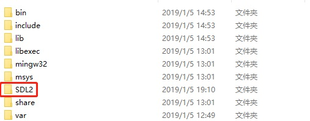

**Windows下编译可调试的ffmpeg, 包含ffplay**

    作者:史正
    邮箱:shizheng163@126.com
    如有错误还请及时指正
    如果有错误的描述给您带来不便还请见谅
    如需交流请发送邮件,欢迎联系
-   我的csdn    : **[https://blog.csdn.net/shizheng163](https://blog.csdn.net/shizheng163)**<br>
-   我的github  : **[https://github.com/shizheng163](https://github.com/shizheng163)**

**目录**
- [简述](#%E7%AE%80%E8%BF%B0)
- [编译环境搭建](#%E7%BC%96%E8%AF%91%E7%8E%AF%E5%A2%83%E6%90%AD%E5%BB%BA)
    - [Mingw+msys+yasm下载与安装](#mingwmsysyasm%E4%B8%8B%E8%BD%BD%E4%B8%8E%E5%AE%89%E8%A3%85)
    - [编译SDL2.0](#%E7%BC%96%E8%AF%91sdl20)
- [编译ffmpeg](#%E7%BC%96%E8%AF%91ffmpeg)
- [ffplay问题](#ffplay%E9%97%AE%E9%A2%98)
- [参考文章](#%E5%8F%82%E8%80%83%E6%96%87%E7%AB%A0)

# 简述
操作系统: Windows10 64<br>
编译工具: MinGW+MSYS+yasm + SDL2.0<br>
-   `MinGW`是Windows下模拟linux运行的库、头文件等的集合。<br>
-   `msys`是Windows下模拟linux运行的最新系统, 可以通过类似于linux bash的命令行窗口进行代码编译。<br>
-   `yasm`是ffmpeg编译时用到的汇编工具。<br>
-   `SDL2.0`, ffmpeg编译ffplay时需要的SDL2源代码, 编译时要生成ffpaly, 执行configure脚本时比较加入`--enable-sdl2`

FFMPEG版本:`ffmpeg-4.1`, 可从FFMPEG官方网址进行下载最新代码.
>[FFMPEG官方网址-http://ffmpeg.org/download.html](http://ffmpeg.org/download.html)

作者这里使用的编译器是QTCreator5.7.1 + MinGW, 同时有GitBash也可以模拟linux环境运行,但是执行完configure脚本后发现`make`命令找不到, 所以干脆按照其他教程使用`MinGW+MSYS+yasm`进行编译。

本文的编译环境安装目录为:`D:\FFMPEGDir\MinGW`

# 编译环境搭建
## Mingw+msys+yasm下载与安装
MinGW+Msys+Yasm的下载与安装可以参考以下博客:
-   [https://blog.csdn.net/zhouyongku/article/details/44961447](https://blog.csdn.net/zhouyongku/article/details/44961447)

下载完成后配置信息请切回本文继续, 本文所述与以上博客有轻微不同。
下载安装完成后MinGW目录结构如下(图中的SDL目录是后来放进去的):<br>
<br>

将下载完成后的yasm-1.3.0-win64.exe改名为`yasm.exe`放置到`D:\FFMPEGDir\MinGW\bin`下面。<br>
进入`D:\FFMPEGDir\MinGW\msys\1.0`执行`msys.bat`
输入`df -h`
```sh
$ df -h
Filesystem            Size  Used Avail Use% Mounted on
C:\Users\shizh\AppData\Local\Temp
                      119G   82G   37G  69% /tmp
D:\FFMPEGDir\MinGW\msys\1.0
                      184G   33G  152G  18% /usr
D:\FFMPEGDir\MinGW\msys\1.0
                      184G   33G  152G  18% /
D:\FFMPEGDir\MinGW    184G   33G  152G  18% /mingw
c:                    119G   82G   37G  69% /c
d:                    184G   33G  152G  18% /d
e:                    151G   74G   77G  49% /e
f:                    301G  213G   88G  71% /f
g:                    150G   14G  137G   9% /g
h:                    148G  4.7G  144G   4% /h
```
可以看到将`D:\FFMPEGDir\MinGW`是挂载到了`/mingw`下面.<br>
输入`gcc -v`验证gcc环境是否准备好。
```
$ gcc -v
Using built-in specs.
COLLECT_GCC=D:\FFMPEGDir\MinGW\bin\gcc.exe
COLLECT_LTO_WRAPPER=d:/ffmpegdir/mingw/bin/../libexec/gcc/mingw32/6.3.0/lto-wrapper.exe
Target: mingw32
Configured with: ../src/gcc-6.3.0/configure --build=x86_64-pc-linux-gnu --host=mingw32 --target=mingw32 --with-gmp=/mingw --with-mpfr --with-mpc=/mingw --with-isl=/mingw --prefix=/mingw --disable-win32-registry --with-arch=i586 --with-tune=generic --enable-languages=c,c++,objc,obj-c++,fortran,ada --with-pkgversion='MinGW.org GCC-6.3.0-1' --enable-static --enable-shared --enable-threads --with-dwarf2 --disable-sjlj-exceptions --enable-version-specific-runtime-libs --with-libiconv-prefix=/mingw --with-libintl-prefix=/mingw --enable-libstdcxx-debug --enable-libgomp --disable-libvtv --enable-nls
Thread model: win32
gcc version 6.3.0 (MinGW.org GCC-6.3.0-1)
```
如果提示gcc环境找不到, 手动设置下环境变量:`export PATH="/mingw/bin:$PATH"`

## 编译SDL2.0
作者这里是自己根据源码编译的, 使用dev版本的SDL2.0执行ffmpeg的configure总是`提示sdl2支持找不到`.<br>
下载SDL2.0源码:[https://www.libsdl.org/download-2.0.php](https://www.libsdl.org/download-2.0.php)

解压后进入相关文件夹
```sh
./configure --prefix=/d/FFMPEGDir/MingGW/SDL2/
make -j4 && make install
```
注意, 这里的`d/FFMPEGDir/MingGW/SDL2/`一定要先创建好<br>
make -j4是启动多线程编译, 4是线程数量, 但线程数量不一定越高越好, 作者使用`make -j`使用最高的线程数进行编译(8个线程), 导致CPU占用率过高, 电脑蓝屏!!!

# 编译ffmpeg
本文ffmpeg源码路径位于:`D:/FFMPEGDir/ffmpeg-4.1/ffmpeg-4.1`<br>

关闭杀毒软件, 作者在编译执行`configure脚本时`时没有关闭360安全卫士, 一直提示出几个编译出的文件是木马软件。网上有一些教程时不关杀毒软件会导致执行脚本失败, 这里倒是没有注意。

进入`D:\FFMPEGDir\MinGW\msys\1.0`, 执行msys.bat。

``` sh
cd D:/FFMPEGDir/ffmpeg-4.1/ffmpeg-4.1
export PATH="/mingw/SDL2/bin/:$PATH"
 ./configure --enable-shared --disable-static --enable-debug --enable-sdl2 --extra-cflags='-I/mingw/SDL2/include/SDL2/' --extra-ldflags='-L/mingw/SDL2/lib/' --prefix=D:/FFMPEGDir/ffmpegExport
```

-   `--enable-debug`是启动调试, 若不加此命令编译出的ffmpeg是无法进行调试的, 就不会生成ffmpeg_g的这些文件
-   `--enable-sdl2`启动SDL环境, 只有启用了sdl环境, 且配置脚本检测无误才会编译出`ffplay`
-   `--extra-cflags`, 额外的指定C编译器寻找的Inlcude路径, 这里是指定SDL2的头文件路径
-   `--extra-ldflags`, 额外指定链接器寻找链接库的路径,这里是指定SDL2的链接库路径
-   `--prefix=D:/FFMPEGDir/ffmpegExport`, 指定编译出的ffmpeg可执行程序以及相关头文件, 动态库的存放位置

执行脚本, 等待脚本退出, 也可在ffmpeg源码的ffbuild路径下执行跟踪追踪进度`tail -100f ffbuild/config.log`


若执行完后, 提示sdl2支持找不到, 那就是SDL库的路径不对, 或者是因为SDL2的dev版本无法使用。

正确执行完后, 在输出的内容中寻找`program`, 看看有没有ffplay, 正常的情况应该是`ffmpeg ffprobe ffplay`.

如果执行完后提示`WARNING: pkg-config not found, library detection may fail.`这个无需理会，这里不会对编译产生影响。

开始编译ffmpeg.
```sh
make -j4 && make install
```
若编译过程中出现如下错误, 打开`libavformat/os_support.h`, 添加`#include <winerror.h>`
```
CC      libavformat/paf.o
In file included from libavformat/os_support.h:112:0,
                 from libavformat/os_support.c:29:
libavformat/os_support.c: In function 'ff_gai_strerror':
libavformat/os_support.c:194:10: error: 'ERROR_NOT_ENOUGH_MEMORY' undeclared (first use in this function)
     case EAI_MEMORY:
          ^
libavformat/os_suppCCort.clibavformat/pcm.o:1
:10: note: each undeclared identifier is reported only once for each function it appears in
make: *** [libavformat/os_support.o] Error 1
make: *** Waiting for unfinished jobs....
```
这里作者不确定会不会出现这个问题, 因为第一天晚上编译时就没有报错, 第二天就出现了这个问题。

编译完成后需要将`MinGWSDL2/bin/SDL2.dll`放置`D:/FFMPEGDir/ffmpegExport/bin/`下, 否则运行ffplay会报
SDL2.dll找不到。<br>

同时, 在cmd中使用ffmpeg与ffplay, ffprobe会报`libiconv-2.dll`找不到, 这时可以从以下网址进行下载, 放入`D:/FFMPEGDir/ffmpegExport/bin/`下。<br>
-   [https://download.csdn.net/download/shizheng163/10898267](https://download.csdn.net/download/shizheng163/10898267)

# ffplay问题
编译后的ffplay执行时会提示如下警告
```
Warning: not compiled with thread support, using thread emulation
```
这是因为gcc版本导致的, 作者将gcc版本降级为5.3, 重新编译ffmpeg就没有出现这个警告了。

**注意:**<br>
作者这里编出的ffpaly播放任何视频都会卡顿在第一帧, 音频会连续播放, 同时移动播放窗口以及在画面内连续点击会进行视频帧的切换, 这里怀疑是SDL的版本不适配导致的问题。

# 参考文章
-   [
ffmpeg ./configure 的相关参数说明](http://blog.csdn.net/momo0853/article/details/78043903)
-   [
Windows下编译FFmpeg详解](https://blog.csdn.net/zhouyongku/article/details/44961447)
-   [
windows 编译FFMPEG](https://blog.csdn.net/wh8_2011/article/details/85228579)