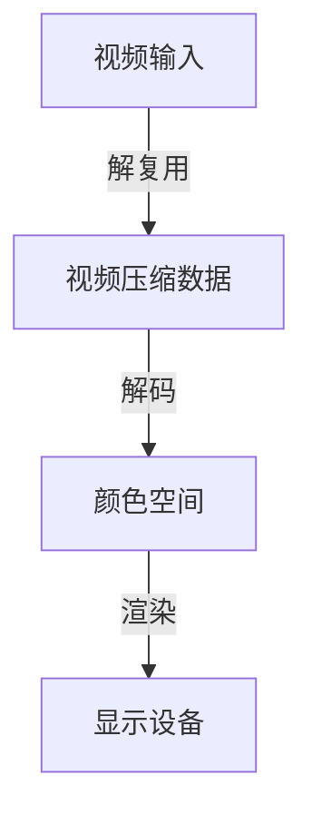
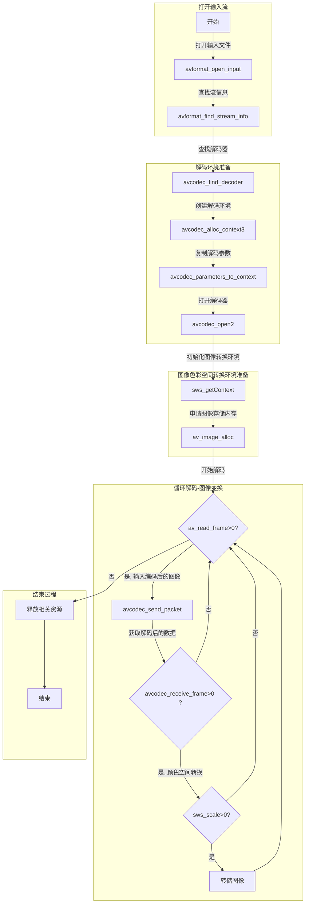

# ffmpeg 解码视频为yuv数据

    作者:史正
    邮箱:shizheng163@126.com
    如有错误还请及时指正
    如果有错误的描述给您带来不便还请见谅
    如需交流请发送邮件,欢迎联系
csdn    : **[https://blog.csdn.net/shizheng163](https://blog.csdn.net/shizheng163)**

github  : **[https://github.com/shizheng163](https://github.com/shizheng163)**

***
目录

- [ffmpeg 解码视频为yuv数据](#ffmpeg-%E8%A7%A3%E7%A0%81%E8%A7%86%E9%A2%91%E4%B8%BAyuv%E6%95%B0%E6%8D%AE)
  - [简述](#%E7%AE%80%E8%BF%B0)
  - [错误处理](#%E9%94%99%E8%AF%AF%E5%A4%84%E7%90%86)
  - [代码实现](#%E4%BB%A3%E7%A0%81%E5%AE%9E%E7%8E%B0)
  - [参考文章](#%E5%8F%82%E8%80%83%E6%96%87%E7%AB%A0)

## 简述

简单描述下视频播放的步骤:



- 解复用:将输入的视频变为编码后的压缩数据
- 解码: 将压缩数据变为颜色空间(YUV, RGB等)
- 渲染: 将YUV等颜色空间绘制在显示设备上形成图像

下面对应上述流程说明下ffmpeg解码为yuv数据的接口调用。

ffmpeg版本:4.1



前文曾经提过解码后的图像数据为YUV420, 如果只需要YUV420, 那么就不需要进行图像转换,图像色彩空间转换环境也无需初始化。

另外为了对比播放器的播放速度特意使用如下命令为视频添加了水印:

- `ffmpeg -i ./Suger.mp4 -vf "drawtext=expansion=strftime:  basetime=$(date +%s -d '2019-01-12 00:00:00')000000 :text='%Y-%m-%d %H\\:%M\\:%S':fontsize=30:fontcolor=white:box=1:x=10:y=10:boxcolor=black@0.5:" -strict -2 -y "SugerTime.mp4"`

2019-01-12 00:00:00为起始时间戳。

## 错误处理

- 处理过程中出现`bad dst image pointers`
  
  此问题是因为没有调用`av_image_alloc`

- 解码过程中出现:`Invalid data found when processing input`

  此问题出现是因为没调用`avcodec_parameters_to_context`与`avcodec_open2`

## 代码实现

如果打开的url是网络流需要先调用`avformat_network_init()` 初始化网络环境。

完整代码可见[[https://github.com/shizheng163/MyMediaPlayer/tree/v0.3.0]]([https://github.com/shizheng163/MyMediaPlayer/tree/v0.3.0])
.h 文件

```c++
/*
 * copyright (c) 2018-2019 shizheng. All Rights Reserved.
 * Please retain author information while you reference code
 * date:   2019-01-13
 * author: shizheng
 * email:  shizheng163@126.com
 */
#ifndef FFDECODER_H
#define FFDECODER_H
#include <string>
#include <fileutil.h>
#include <functional>
#include <mutex>
#include <thread>
struct AVFormatContext;
struct AVFrame;
struct AVCodecContext;
namespace ffmpegutil {
typedef fileutil::PictureFilePtr YuvDataPtr;
class FFDecoder
{
public:
    typedef std::function<void (YuvDataPtr pYuvData) > ProcessYuvDataCallback;
    typedef std::function<void (bool bIsOccurErr) > DecodeThreadExitCallback;
    FFDecoder();
    ~FFDecoder();
    bool InitializeDecoder(std::string url);
    bool StartDecodeThread();
    void StopDecodeThread();
    /**
     * @brief 设置解码数据回调函数
     */
    void SetProcessDataCallback(ProcessYuvDataCallback callback);
    /**
     * @brief 设置解码线程退出的回调函数
     */
    void SetDecodeThreadExitCallback(DecodeThreadExitCallback callback);
    /**
     * @brief 获取错误原因
     * @note 当错误发生时, 错误原因会被记录
     */
    std::string ErrName() const { return m_szErrName;}
    /**
     * @brief 获取视频帧率
     */
    float GetVideoFrameRate();
private:

    void decodeInThread();

    std::string                 m_szUrl;
    AVFormatContext             *m_pInputFormatContext;
    int                         m_nVideoStreamIndex;
    AVCodecContext              *m_pCodecContext;

    //处理解码后数据的回调函数
    std::mutex                  m_mutexForFnProcessYuvData;
    ProcessYuvDataCallback      m_fnProcssYuvData;

    std::thread                 m_threadForDecode;
    bool                        m_bIsRunDecodeThread;

    std::string                 m_szErrName;

    //处理解码线程退出的回调函数
    std::mutex                  m_mutexForFnThreadExit;
    DecodeThreadExitCallback    m_fnThreadExit;
};
}//namespace ffmpegutil

#endif // FFDECODER_H

```

cpp文件

```c++
/*
 * copyright (c) 2018-2019 shizheng. All Rights Reserved.
 * Please retain author information while you reference code
 * date:   2019-01-13
 * author: shizheng
 * email:  shizheng163@126.com
 */
#include "ffdecoder.h"
#include <memory>
extern "C"
{
#include <libavformat/avformat.h>
#include <libswscale/swscale.h>
#include <libavutil/imgutils.h>
}
#include "logutil.h"
#include "ffmpegutil.h"


using namespace ffmpegutil;
using namespace std;
using namespace logutil;

typedef std::shared_ptr<AVPacket> AVPacketPtr;
typedef std::shared_ptr<AVFrame> AVFramePtr;

FFDecoder::FFDecoder()
    :m_pInputFormatContext(NULL)
    ,m_nVideoStreamIndex(-1)
    ,m_pCodecContext(NULL)
{
}

FFDecoder::~FFDecoder()
{
    if(m_threadForDecode.joinable())
        m_threadForDecode.join();

    if(m_pInputFormatContext)
    {
        avformat_close_input(&m_pInputFormatContext);
        avformat_free_context(m_pInputFormatContext);
        m_pInputFormatContext = NULL;
    }
    if(m_pCodecContext)
    {
        avcodec_free_context(&m_pCodecContext);
        m_pCodecContext = NULL;
    }
}

bool FFDecoder::InitializeDecoder(string url)
{
    m_szUrl = url;
    int ret = 0;
    ret = avformat_open_input(&m_pInputFormatContext, m_szUrl.c_str(), NULL, NULL);
    //GetStrError是对av_strerror的一次封装。
    if(ret < 0)
    {
        m_szErrName = MySprintf("FFDecoder open input failed, url = %s, err: %s", m_szUrl.c_str(), GetStrError(ret).c_str());
        return false;
    }
    for(unsigned i = 0; i < m_pInputFormatContext->nb_streams; i++)
    {
        if(m_pInputFormatContext->streams[i]->codecpar->codec_type == AVMEDIA_TYPE_VIDEO)
        {
            m_nVideoStreamIndex = i;
            break;
        }
    }

    if( m_nVideoStreamIndex == -1)
    {
        m_szErrName = MySprintf("FFDecoder could find video stream, url = %s", m_szUrl.c_str());
        return false;
    }

    ret = avformat_find_stream_info(m_pInputFormatContext, NULL);
    if(ret < 0)
    {
        m_szErrName = MySprintf("FFDecoder find stream info failed, url = %s, err: %s", m_szUrl.c_str(), GetStrError(ret).c_str());
        return false;
    }

//    av_dump_format(m_pInputFormatContext, m_nVideoStreamIndex, NULL, 0);

    //InitAVDecoder
    AVCodec * pCodec = avcodec_find_decoder(m_pInputFormatContext->streams[m_nVideoStreamIndex]->codecpar->codec_id);
    if(!pCodec)
    {
        m_szErrName = MySprintf("FFDecoder find AVCodec failed, url = %s, codec: %s", m_szUrl.c_str(), avcodec_get_name(m_pInputFormatContext->streams[m_nVideoStreamIndex]->codecpar->codec_id));
        return false;
    }
    m_pCodecContext = avcodec_alloc_context3(pCodec);

    //复制解码器参数
    ret = avcodec_parameters_to_context(m_pCodecContext, m_pInputFormatContext->streams[m_nVideoStreamIndex]->codecpar);

    if(ret < 0)
    {
        m_szErrName = MySprintf("FFDecoder avcodec_parameters_to_context failed, url = %s, err = %s", m_szUrl.c_str(), avcodec_get_name(m_pInputFormatContext->streams[m_nVideoStreamIndex]->codecpar->codec_id), GetStrError(ret).c_str());
        return false;
    }

    ret = avcodec_open2(m_pCodecContext, pCodec, NULL);
    if(ret < 0)
    {
        m_szErrName = MySprintf("FFDecoder AVCodec Open  failed, url = %s, codec: %s, err = %s", m_szUrl.c_str(), avcodec_get_name(m_pInputFormatContext->streams[m_nVideoStreamIndex]->codecpar->codec_id), GetStrError(ret).c_str());
        return false;
    }
    return true;
}

bool FFDecoder::StartDecodeThread()
{
    if(!m_pCodecContext)
    {
        m_szErrName = "decode context not init!";
        return false;
    }
    m_bIsRunDecodeThread = true;
    m_threadForDecode = std::thread(&FFDecoder::decodeInThread, this);
    return true;
}

void FFDecoder::SetProcessDataCallback(FFDecoder::ProcessYuvDataCallback callback)
{
    std::unique_lock<mutex> locker(m_mutexForFnProcessYuvData);
    m_fnProcssYuvData = callback;
}

void FFDecoder::SetDecodeThreadExitCallback(FFDecoder::DecodeThreadExitCallback callback)
{
    std::unique_lock<mutex> locker(m_mutexForFnThreadExit);
    m_fnThreadExit = callback;
}

void FFDecoder::StopDecodeThread()
{
    m_bIsRunDecodeThread = false;
}

float FFDecoder::GetVideoFrameRate()
{
    if(m_pInputFormatContext)
    {
        return (float)m_pInputFormatContext->streams[m_nVideoStreamIndex]->avg_frame_rate.num / m_pInputFormatContext->streams[m_nVideoStreamIndex]->avg_frame_rate.den ;
    }
    return 0;
}

void FFDecoder::decodeInThread()
{
    bool isEof = false;

    AVFramePtr pFrameScale(av_frame_alloc(), [](AVFrame * ptr){
        av_frame_free(&ptr);
        //释放调用av_image_alloc申请的内存
        av_free(&ptr->data[0]);
    });

    int ret = 0;

    //初始化图像转换器
    AVStream * pVideoStream = m_pInputFormatContext->streams[m_nVideoStreamIndex];
    SwsContext * pswsContext = sws_getContext(pVideoStream->codecpar->width, pVideoStream->codecpar->height, (AVPixelFormat)pVideoStream->codecpar->format,
                                              pVideoStream->codecpar->width, pVideoStream->codecpar->height, AV_PIX_FMT_YUV420P,
                                              SWS_FAST_BILINEAR, 0, 0, 0);
    //申请图像存储内存
    av_image_alloc(pFrameScale->data, pFrameScale->linesize, pVideoStream->codecpar->width, pVideoStream->codecpar->height, AV_PIX_FMT_YUV420P, 1);

    while(m_bIsRunDecodeThread)
    {
        AVPacketPtr ptrAVPacket(av_packet_alloc(), [](AVPacket * ptr){
            av_packet_free(&ptr);
        });
        av_init_packet(ptrAVPacket.get());
        ret = av_read_frame(m_pInputFormatContext, ptrAVPacket.get());
        if(ret < 0)
        {
            string szErrName = GetStrError(ret).c_str();
            if(szErrName != "End of file")
                m_szErrName = MySprintf("FFMpeg Read Frame Failed, Err = %s", szErrName.c_str());
            else
            {
                MyLog(info, "FFMpeg Read Frame Complete!");
                isEof = true;
            }
            break;
        }
        if(ptrAVPacket->stream_index == m_nVideoStreamIndex)
        {
            ret = avcodec_send_packet(m_pCodecContext, ptrAVPacket.get());
            AVFramePtr pTempFrame(av_frame_alloc(), [](AVFrame * ptr){
                av_frame_free(&ptr);
            });
            while(1)
            {
                ret = avcodec_receive_frame(m_pCodecContext, pTempFrame.get());
                if(ret != 0)
                    break;
                ret= sws_scale(pswsContext, (const uint8_t* const*)pTempFrame->data, pTempFrame->linesize, 0, pTempFrame->height,
                               (uint8_t* const*)pFrameScale->data, pFrameScale->linesize);
                if(ret > 0)
                {
                    fileutil::FileRawData data;
                    data.AppendData(pFrameScale->data[0], pVideoStream->codecpar->width * pVideoStream->codecpar->height);
                    data.AppendData(pFrameScale->data[1], pVideoStream->codecpar->width * pVideoStream->codecpar->height / 4);
                    data.AppendData(pFrameScale->data[2], pVideoStream->codecpar->width * pVideoStream->codecpar->height / 4);
                    YuvDataPtr pYuvData(new fileutil::PictureFile(data, pVideoStream->codecpar->width, pVideoStream->codecpar->height, fileutil::PictureFile::kFormatYuv));
                    pYuvData->m_filename = to_string(pVideoStream->codec_info_nb_frames);
                    std::unique_lock<mutex> locker(m_mutexForFnProcessYuvData);
                    if(m_fnProcssYuvData)
                        m_fnProcssYuvData(pYuvData);
                }
            }
        }
    }
    MyLog(m_bIsRunDecodeThread && !isEof ? err : info, "FFDecoder %s exit!\n", m_bIsRunDecodeThread && !isEof ? "abnormal" : "normal");
    std::unique_lock<mutex> locker(m_mutexForFnThreadExit);
    if(m_fnThreadExit)
        m_fnThreadExit(m_bIsRunDecodeThread && !isEof);
}
```

## 参考文章

- [ffmpeg简易播放器的实现-完善版](https://www.lmlphp.com/user/901/article/item/13844)
- [QT+ffmpeg 简单视频播放代码及问题记录](https://blog.csdn.net/Chasing_Chasing/article/details/78824299)